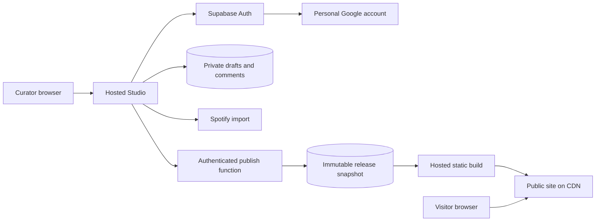

# Architecture

Updated: 2026-09-27. The online architecture below is proposed, not provisioned. Accepted constraints are recorded in [decisions](decisions.md).

## Current system

The local Vite Studio loads catalogue JSON and browser storage. Most edits save to browser storage; a development-server endpoint writes JSON and regenerates `site/`. Vercel runs the generator and serves that static output. Spotify authentication currently authorizes imports; it is not an access-control system for a hosted editor.

An online Studio cannot rely on the current development middleware or durable writes to a hosting function's local filesystem. Those operations need database-backed replacements.

## Recommended starting stack

| Need | Proposal | Reason |
|---|---|---|
| Online Studio | Existing Vite/JavaScript frontend on Vercel Hobby | Reuse the code and existing hosting familiarity |
| Login | Personal Google account, proposed through Supabase Auth | Google is chosen to separate personal curation from work; the managed auth service is still proposed |
| Editorial storage | Supabase Free Postgres and row-level security | Database, authentication, and data API in one managed service |
| Privileged operations | A few Vercel functions | Authorize publishing and keep deployment secrets out of the browser |
| Public site | Generated static pages on Vercel | Public reading/listening does not require the editing database at runtime |
| Diagnostics | Structured console events and a small activity table | No paid logging service or separate server |

Keep the existing JavaScript approach. Add the database client and small modules for persistence, auth, import/merge, publishing, and audio as needed. Reuse the current generator and design direction. Introduce SQL migrations in version control during implementation; a separate ORM is not required initially.

This diagram describes the target. v1 remains the active product until the cutover procedure is approved and executed.

## Free tier tradeoffs

Checked against official provider documentation on 2026-09-27; recheck before provisioning.

- Vercel Hobby is free for personal, noncommercial projects and has usage caps. It fits the stated pet-project scope. Keep any new project on Hobby. [Hobby plan](https://vercel.com/docs/plans/hobby), [pricing](https://vercel.com/pricing).
- Supabase Free includes Postgres, social authentication, a 500 MB database, and 5 GB egress. Automatic backups are not included. Keep metadata and text in the database; do not copy audio or artwork into storage. [Pricing](https://supabase.com/pricing).
- Supabase can pause projects with low activity over seven days. Resuming through its dashboard may be necessary before editing again. A static public release continues serving independently. Plan export/restore rather than relying on the free service as the only copy. [Project pausing](https://supabase.com/docs/guides/platform/free-project-pausing).
- Alternative: Cloudflare Workers with D1 offers a free database allowance, including 5 million rows read/day, 100,000 written/day, and 5 GB total storage. It would require a different server integration and an authentication choice. Prefer this alternative if the Supabase inactivity behavior is unacceptable; compare the full auth and hosting path before adopting it. [D1 pricing](https://developers.cloudflare.com/d1/platform/pricing/).

The recommendation optimizes for few moving parts and little custom authentication code. It is not a promise of unlimited free use or permanent availability. No paid plan, add-on, or service upgrade is authorized. If limits become a problem, first reduce usage or revisit the design.

## Authentication and permissions

Studio login and Spotify connection are separate: the curator can read and edit saved content while disconnected from Spotify. Spotify access is needed only for imports or refreshes.

Personal Google login is confirmed in [D009](decisions.md#d009--personal-google-login-and-project-ownership), replacing the earlier GitHub choice. Social login proves identity; it does not grant editing access by itself. Provision one trusted curator user ID outside the client and enforce that identity in every database policy and privileged function. Bind that ID to the owner's verified personal Google identity during setup; do not automatically authorize the first person who signs in. Use stable user IDs for permissions rather than display names or a broad email-domain rule. Other authenticated users, including a work Google account, and anonymous clients must have no access to draft rows, releases, activity history, or mutations.

Create the Google OAuth project under the owner's personal account, outside employer organizations. Use personally owned hosting and database projects too; inspect existing ownership before provisioning or connecting services. Repository access through the shared GitHub account does not grant Studio access. Keep any Google client secret in the managed auth provider's configuration, outside browser code and Git.

Request only identity, email, and basic profile scopes (`openid`, `email`, `profile`, or the provider's equivalent scope URLs). Show an account chooser when starting Google sign-in (`prompt=select_account`); do not silently choose a work account through automatic sign-in. Account selection is a convenience, while database and server permissions enforce access. If the wrong account is selected, show an access-denied state with a way to switch accounts. [Supabase Google setup](https://supabase.com/docs/guides/auth/social-login/auth-google), [Google OpenID Connect options](https://developers.google.com/identity/openid-connect/openid-connect).

Enable row-level security on every exposed table. Require both the authorized curator and matching ownership for writes and reads. The browser uses only a publishable key and its session. Never ship a service-role key, deployment hook, or provider secret to it. Functions verify the session and curator identity before privileged work; restricted database operations are preferred over broad administrative access. [Supabase row-level security](https://supabase.com/docs/guides/database/postgres/row-level-security).

Use exact hosted callback URLs for Studio login and Spotify PKCE. Keep preview secrets separate from existing production configuration. The initial Spotify connection can remain browser-based with explicit reconnection on another device, avoiding a shared server token store until needed.

## Minimum data model

Proposed application tables, in addition to managed authentication and the curator authorization setting:

| Table | Minimum responsibilities |
|---|---|
| `playlists` | Stable ID, owner, Spotify ID, stable slug, imported metadata, editorial overrides, order, timestamps, revision |
| `playlist_items` | Stable entry ID, playlist reference, source track ID/metadata, position, curator comment, timestamps, revision, removed-from-source marker |
| `releases` | Immutable public content snapshot, schema version, source revision, release ID, publication status, deployment reference |
| `activity_events` | Bounded operation history: time, operation, entity ID, outcome, correlation ID, safe error code |

Comments belong to a playlist entry initially: the same song may have different notes in different playlists. Duplicate track occurrences and matching across Spotify refreshes must be specified before migration. Removed source entries retain their comments until explicitly discarded. Imported descriptions and editorial descriptions are separate fields.

Every accepted save increments a revision. A stale save returns a conflict without overwriting newer content. Commit multi-row imports and release snapshots transactionally. Changes to a comment must not rewrite the entire catalogue. Save after a short editing pause or on explicit confirmation; display `saving`, `saved`, `failed`, or `conflict` states. Offer local recovery for failed edits without treating browser storage as the authority or automatically replaying stale content.

## Publishing without a laptop

1. Save drafts in the database. Preview them only in the authenticated Studio.
2. On Publish, validate and atomically capture a complete, immutable snapshot containing only selected public content. No account data, draft-only fields, or tokens are included.
3. An authenticated hosted endpoint starts the static build. Bind that build to a specific release ID; it must never read live draft tables or an identifier that can change mid-build.
4. Build public HTML, playlist JSON, and sharing metadata from that snapshot. Cacheable public files serve all visitor reads; there is no public database dependency.
5. Report published only after confirming successful deployment of that exact release ID. Failure retains the previously live version, with retry against the same snapshot.

The concrete Vercel trigger/API and success-check mechanism are a bounded implementation investigation, not chosen yet. It must support immutable release binding, idempotent retry, visible failure, and the free plan. Avoid build-on-every-edit. Start with a single publication in flight; no worker queue service is needed at this scale. Build-time credentials and hook secrets stay server-side.

## Migration and coexistence

The current stable branch is `master`; v2 work is on `codex/v2-online-studio`, starting from `be6c045`. Git branches isolate code, not provider configuration or database contents. The existing Vercel production-branch setting has not been inspected.

Use a distinct v2 hosting project/URL and separate database during development. Keep the current site/domain and local v1 data untouched by v2 imports or publishing. Do not repoint the production domain while validating v2. Confirm project settings before any deployment. A separate v1 checkout/worktree is an option if both local code versions need to run simultaneously.

Before import, export the active v1 browser data and back up the disk JSON. Compare them and resolve differing comments explicitly. Import repeatably, preserve slugs/order/comments, and record a count report. Do not silently replace newer browser content with repository data.

The owner will try the hosted Studio before switching. During that trial, v1 is the editorial source of record; v2 is a copy. Avoid dual editing. At cutover, briefly freeze edits, reconcile the final v1 delta (including any intentional v2 trial edits), export both versions, validate the new release, and then change production routing. Keep the old deployment and export available. After cutover, rolling back the frontend must not overwrite newer database comments; content rollback requires its own reconciliation.

## Acceptance of the first hosted increment

The owner signs in, opens a migrated playlist, edits a comment, and sees it from another browser/device. An anonymous client and an unrelated authenticated account cannot read or modify drafts. A failed or conflicting save remains recoverable. The owner can export and restore editorial data. The live v1 site is unaffected.
